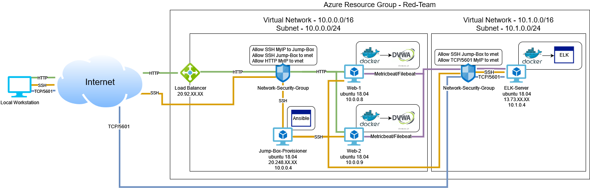

# CybersecBootcamp
A collection of sample work from my cybersecurity bootcamp.

## Automated ELK Stack Deployment

The files in this repository were used to configure the network depicted below.

These files have been tested and used to generate a live ELK deployment on Azure. They can be used to recreate the entire deployment pictured above. Alternatively, select portions of the YAML files below may be used to install only certain pieces of it, such as Filebeat.

  - [Ansible/install-elk.yml](Ansible/install-elk.yml)
  - [Ansible/roles/filebeat-playbook.yml](Ansible/roles/filebeat-playbook.yml)
  - [Ansible/roles/metricbeat-playbook.yml](Ansible/roles/metricbeat-playbook.yml)

This document contains the following details:
- Description of the Topology
- Access Policies
- ELK Configuration
  - Beats in Use
  - Machines Being Monitored
- How to Use the Ansible Build

### Description of the Topology

The main purpose of this network is to expose a load-balanced and monitored instance of DVWA, the D\*mn Vulnerable Web Application.

Load balancing ensures that the application will be highly available, in addition to restricting traffic to the network. By implementing a jump box for SSH management we limit the exposure of our servers to further mitigate risk.

Integrating an ELK server allows users to easily monitor the vulnerable VMs for changes to the file system and system metrics. We use Filebeat to keep tabs on the file system and Metricbeat for system metrics and health data.

The configuration details of each machine may be found below.
_Note: Use the [Markdown Table Generator](http://www.tablesgenerator.com/markdown_tables) to add/remove values from the table_.

| Name       | Function         | IP Address       | Operating System |
|------------|------------------|------------------|------------------|
| Jump Box   | SSH Gateway      | 10.0.0.4, Public | ubuntu 18.04     |
| Web-1      | DVWA Web Server  | 10.0.0.8         | ubuntu 18.04     |
| Web-2      | DVWA Web Server  | 10.0.0.9         | ubuntu 18.04     |
| ELK-Server | ELK Stack Server | 10.1.0.4, Public | ubuntu 18.04     |
