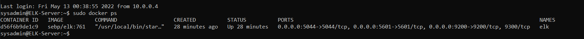

# CybersecBootcamp
A collection of sample work from my cybersecurity bootcamp.

## Automated ELK Stack Deployment

The files in this repository were used to configure the network depicted below.

These files have been tested and used to generate a live ELK deployment on Azure. They can be used to recreate the entire deployment pictured above. Alternatively, select portions of the YAML files below may be used to install only certain pieces of it, such as Filebeat.

  - [Ansible/install-elk.yml](Ansible/install-elk.yml)
  - [Ansible/roles/filebeat-playbook.yml](Ansible/roles/filebeat-playbook.yml)
  - [Ansible/roles/metricbeat-playbook.yml](Ansible/roles/metricbeat-playbook.yml)

This document contains the following details:
- Description of the Topology
- Access Policies
- ELK Configuration
  - Beats in Use
  - Machines Being Monitored
- How to Use the Ansible Build

### Description of the Topology

The main purpose of this network is to expose a load-balanced and monitored instance of DVWA, the D\*mn Vulnerable Web Application.

Load balancing ensures that the application will be highly available, in addition to restricting traffic to the network. By implementing a jump box for SSH management we limit the exposure of our servers to further mitigate risk.

Integrating an ELK server allows users to easily monitor the vulnerable VMs for changes to the file system and system metrics. We use Filebeat to keep tabs on the file system and Metricbeat for system metrics and health data.

The configuration details of each machine may be found below.

| Name       | Function         | IP Address       | Operating System |
|------------|------------------|------------------|------------------|
| Jump Box   | SSH Gateway      | 10.0.0.4, Public | ubuntu 18.04     |
| Web-1      | DVWA Web Server  | 10.0.0.8         | ubuntu 18.04     |
| Web-2      | DVWA Web Server  | 10.0.0.9         | ubuntu 18.04     |
| ELK-Server | ELK Stack Server | 10.1.0.4, Public | ubuntu 18.04     |

### Access Policies

The machines on the internal network are not exposed to the public Internet. 

Only the Jump Box machine can accept SSH connections from the Internet. Access to this machine is only allowed from my public IP.

Machines within the network can only be managed by the Jump Box. From its private IP (10.0.0.4) it can reach the other systems on the virtual network, including the ELK-Server.

A summary of the access policies in place can be found in the table below.

| Name       | Protocol | Publicly Accessible | Allowed IP Addresses |
|------------|----------|---------------------|----------------------|
| Jump Box   | SSH      | Yes                 | My public IP         |
| Web-1      | SSH      | No                  | 10.0.0.4             |
| Web-2      | SSH      | No                  | 10.0.0.4             |
| Elk-Server | SSH      | No                  | 10.0.0.4             |
| Web-1      | HTTP     | Yes                 | My public IP         |
| Web-2      | HTTP     | Yes                 | My public IP         |
| Elk-Server | TCP/5601 | Yes                 | My public IP         |

### Elk Configuration

Ansible was used to automate configuration of the ELK machine. No configuration was performed manually, which is advantageous because it allows us to efficiently deploy the software to many machines at once.  It also provides us with a baseline template that we can use for future installs, helping to save time and minimize deployment errors.

The [install-elk.yml](Ansible/install-elk.yml) playbook implements the following tasks:
- _TODO: In 3-5 bullets, explain the steps of the ELK installation play. E.g., install Docker; download image; etc._
- Install docker.io for containerization
- Install pip3, a Python package manager
- Install the Docker module using pip
- Configure the system to provide sufficient memory to run ELK
- Download and launch a Docker ELK container, setting it to start automatically

The following screenshot displays the result of running `docker ps` after successfully configuring the ELK instance.

